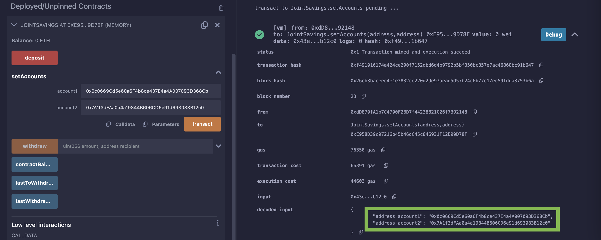
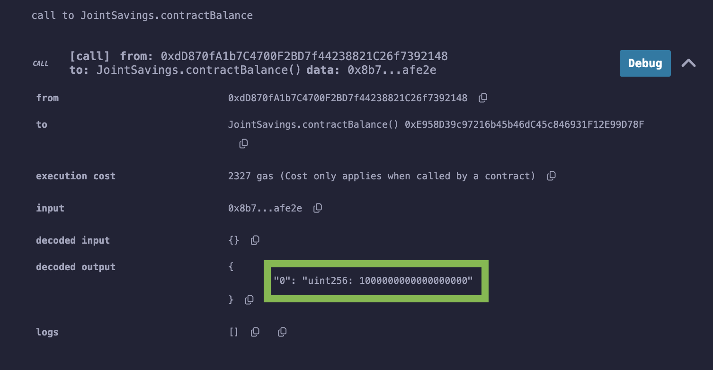
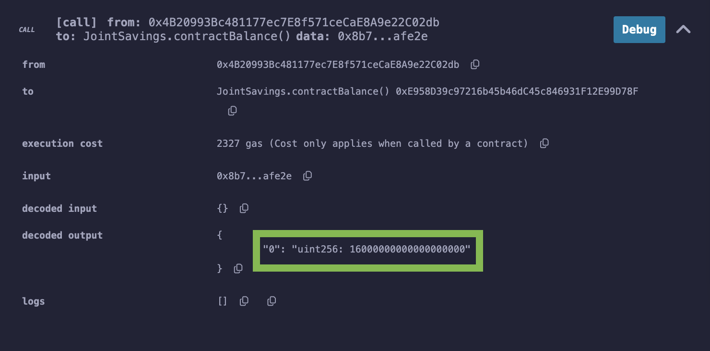
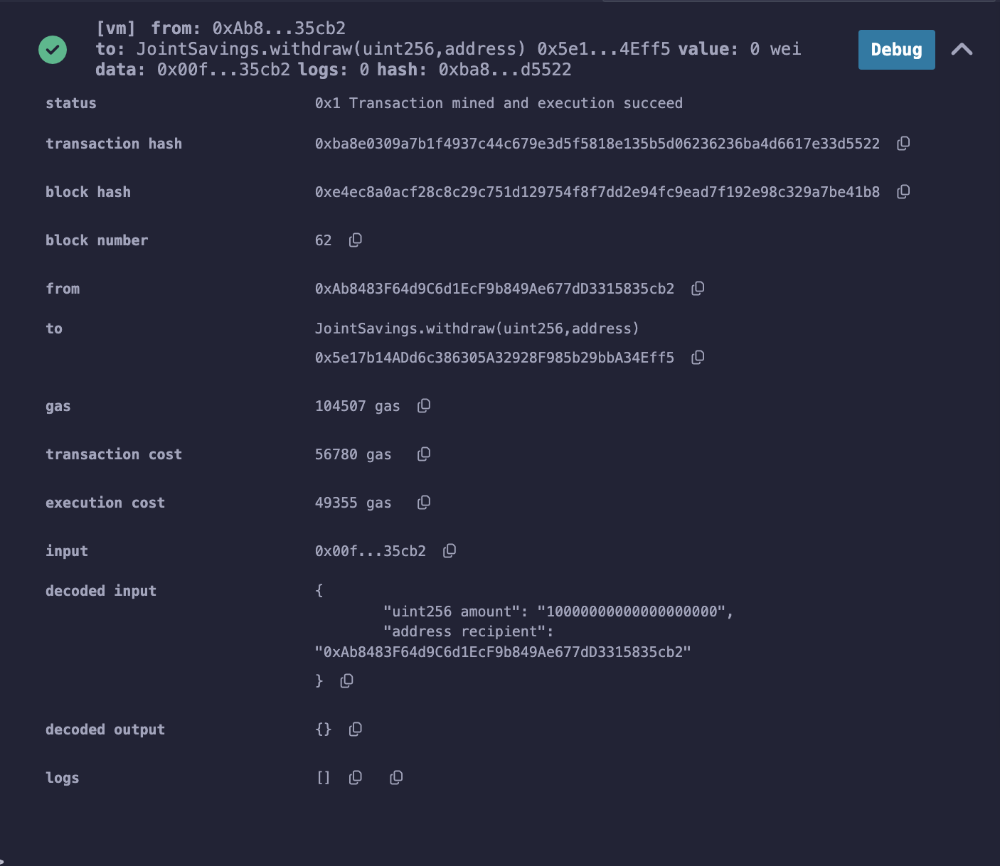
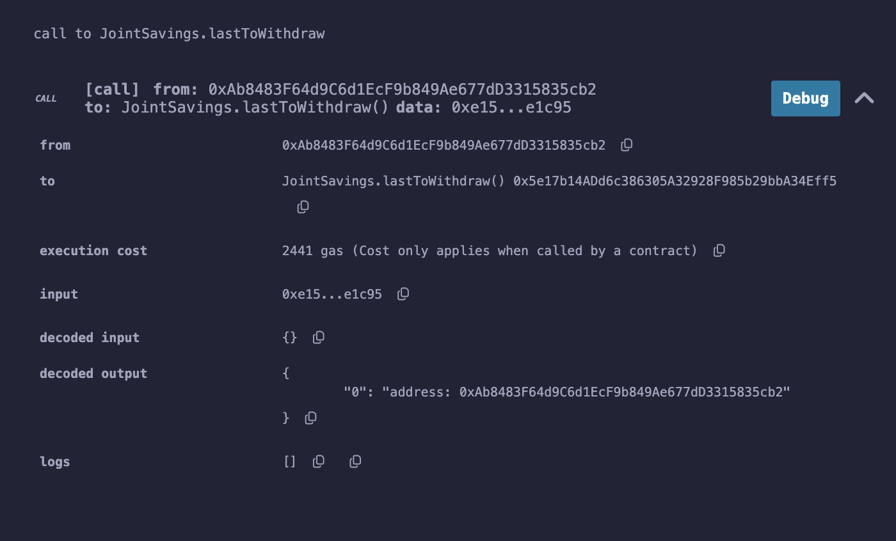
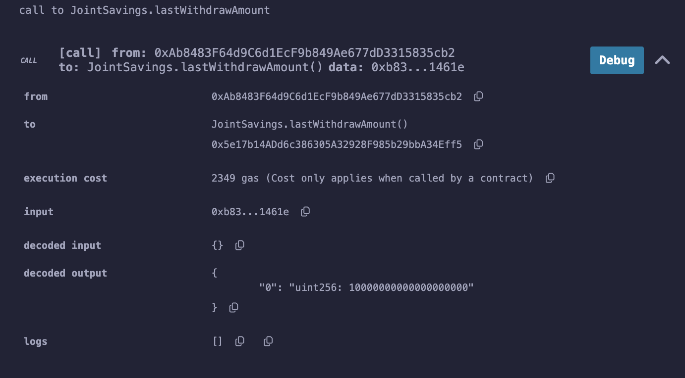

1. Set Accounts
Dummy account1 address: 0x5B38Da6a701c568545dCfcB03FcB875f56beddC4
Dummy account2 address: 0xAb8483F64d9C6d1EcF9b849Ae677dD3315835cb2

2. Transaction 1: Send 1 ether as wei.

3. Transaction 2: Send 10 ether as wei.

4. Transaction 3: Send 5 ether as wei.

5. Withdraw 5 Ether into `accountOne`

6. Withdraw 10 Ether into `accountTwo`

7. Verify lastToWithdraw &amp; lastWithdrawAmount

